<!-- README.md is generated from README.Rmd. Please edit that file -->

# **GLM.RMoE**: LASSO Regularized Mixture-of-Experts Models

<!-- badges: start -->

<!-- badges: end -->

`GLM.RMoE` is an R package for fitting regularized mixture-of-experts models with generalized linear experts. 

The package provides regularized Gaussian, multinomial, and Poisson mixture-of-experts models with LASSO-based feature
selection.

The package accompanies the paper:

*Regularized Estimation and Feature Selection in Mixtures of Generalized Linear Experts.* Ref: arXiv:xxxx.xxxxx, September, 2026 by Thin Nguyen, Faicel Chamroukhi, Ha Hoang and Tuyen Huynh. Please cite the paper and the toolbox when using the
code.

This package has three main functions:

| Function         | Model         |
| ---------------- | ------------- |
| `GaussRMoE()`    | Gaussian RMoE |
| `LogisticRMoE()` | Multinomial RMoE |
| `PoissonRMoE()`  | Poisson RMoE  |

# Installation

Install package:

``` r
# install.packages("devtools")
devtools::install_github("nv-thin/GLM-RMoE")
```

Install with vignettes:

``` r
devtools::install_github(
  "nv-thin/GLM-RMoE",
  build_vignettes = TRUE,
  build_opts = c("--no-resave-data", "--no-manual")
)
```

Use the following command to display vignettes:

``` r
browseVignettes("GLM.RMoE")
```

# Main features

- Gaussian regularized mixture-of-experts
- Multinomial regularized mixture-of-experts
- Poisson regularized mixture-of-experts
- LASSO-based feature selection
- Proximal Newton optimization
- Proximal Newton-type optimization

# Usage

``` r
library(GLM.RMoE)
```

<details>

<summary>Gaussian Regularized Mixture-of-Experts</summary>

The following example fits a Gaussian RMoE model to a simulated dataset with two experts.

``` r
data("gaussian")

X <- as.matrix(gaussian[, -8])
y <- gaussian$V8

grmoe <- GaussRMoE(
  Xm = X,
  Ym = y,
  K = 2,
  Lambda = 5,
  Gamma = 5,
  option = FALSE # FALSE: proximal Newton; TRUE: proximal Newton-type
)

grmoe$plot()
```

The fitted model can be visualized using `plot()`.

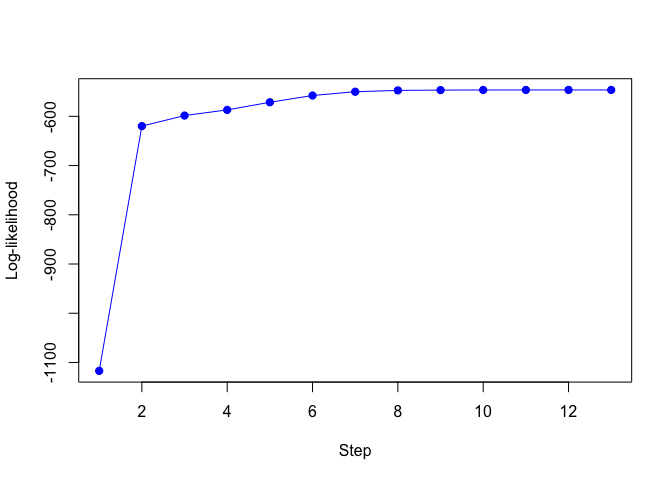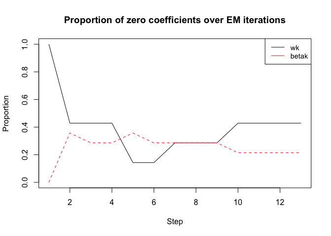

The following example fits a Gaussian RMoE model to a real dataset with two experts.

``` r

data("housing")

X <- as.matrix(housing[, -15])
y <- housing$V15

grmoe <- GaussRMoE(
  Xm = X,
  Ym = y,
  K = 2,
  Lambda = 42,
  Gamma = 10,
  option = FALSE # FALSE: proximal Newton; TRUE: proximal Newton-type
)

grmoe$plot()
```

The fitted model can be visualized using `plot()`.

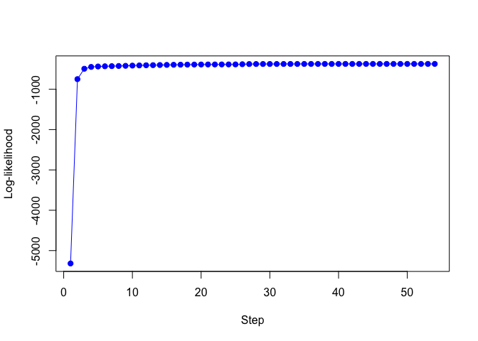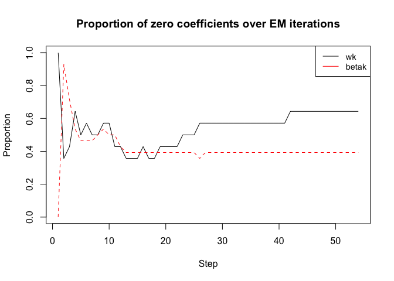

</details>

<details>

<summary>Multinomial Regularized Mixture-of-Experts</summary>

The following example fits a multinomial RMoE model to a simulated dataset with two experts.

``` r

data("logistic")

X <- as.matrix(logistic[, -8])
y <- logistic$V8

lrmoe <- LogisticRMoE(
  Xmat = X,
  Ymat = y,
  K = 2,
  Lambda = 3,
  Gamma = 3,
  option = FALSE # FALSE: proximal Newton; TRUE: proximal Newton-type
)

lrmoe$plot()
```

The fitted model can be visualized using `plot()`.

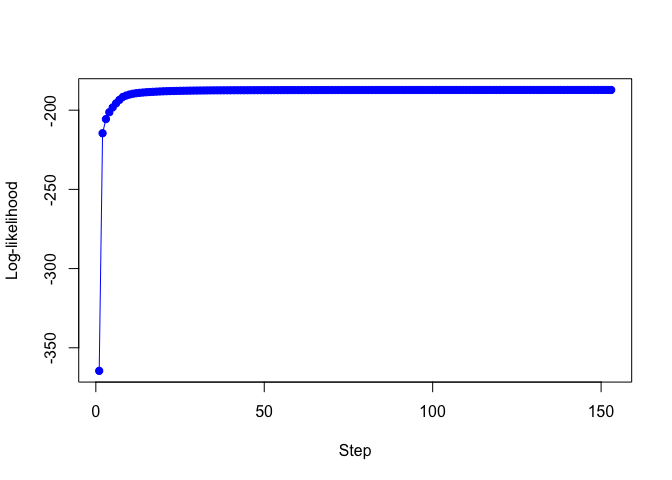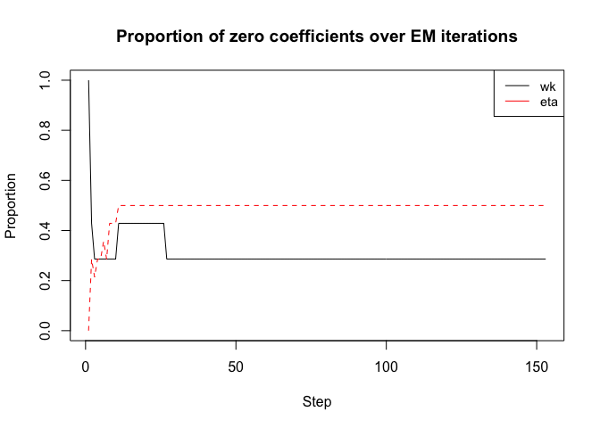

The following example fits a multinomial RMoE model to a real dataset with two experts.

``` r

data("ionosphere")

X <- as.matrix(ionosphere[, -35])
y <- ionosphere$V35

lrmoe <- LogisticRMoE(
  Xmat = X,
  Ymat = y, 
  K = 2, 
  Lambda = 3, 
  Gamma = 3, 
  option = FALSE # FALSE: proximal Newton; TRUE: proximal Newton-type
)

lrmoe$plot()
```

The fitted model can be visualized using `plot()`.

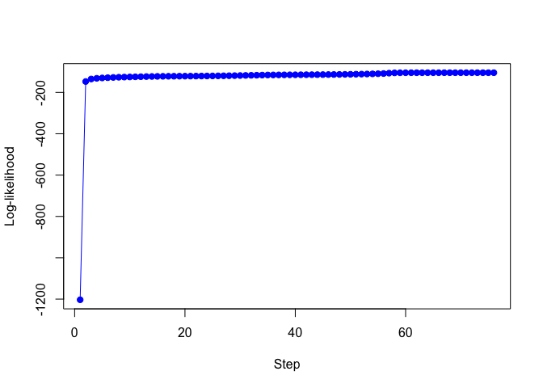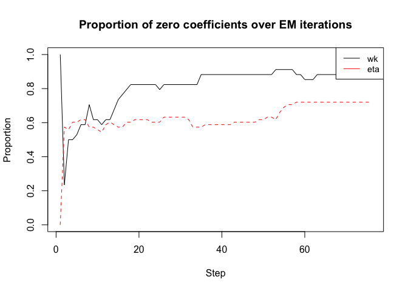

</details>

<details>

<summary>Poisson Regularized Mixture-of-Experts</summary>

``` r
# Application to a simulated data set

data("poisson")
X <- as.matrix(poisson[, -8])
y <- poisson$V8

K <- 2 # Number of experts
Lambda <- 20
Gamma <- 10
opt <- FALSE # opt = FALSE: proximal Newton; opt = TRUE: proximal Newton-type

prmoe <- PoissonRMoE(Xmat = X, Ymat = y, K = K, Lambda = Lambda, 
                   Gamma = Gamma, option = opt, verbose = TRUE)
#> EM - PRMoE: Iteration: 1 | log-likelihood: -2635.67
#> EM - PRMoE: Iteration: 2 | log-likelihood: -846.578541194069
#> EM - PRMoE: Iteration: 3 | log-likelihood: -706.893628429489
#> EM - PRMoE: Iteration: 4 | log-likelihood: -603.248643134253
#> EM - PRMoE: Iteration: 5 | log-likelihood: -587.86820239048
#> EM - PRMoE: Iteration: 6 | log-likelihood: -586.49170206365
#> EM - PRMoE: Iteration: 7 | log-likelihood: -585.986220776523
#> EM - PRMoE: Iteration: 8 | log-likelihood: -585.794873144112
#> EM - PRMoE: Iteration: 9 | log-likelihood: -585.723312637343
#> EM - PRMoE: Iteration: 10 | log-likelihood: -585.696804827654
#> EM - PRMoE: Iteration: 11 | log-likelihood: -585.68704288109
#> EM - PRMoE: Iteration: 12 | log-likelihood: -585.683456598146

prmoe$plot()
```

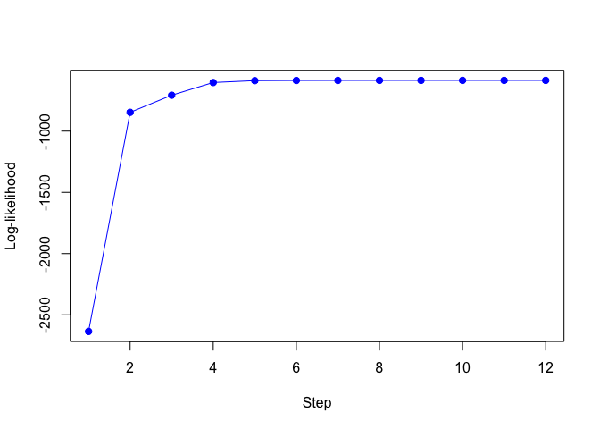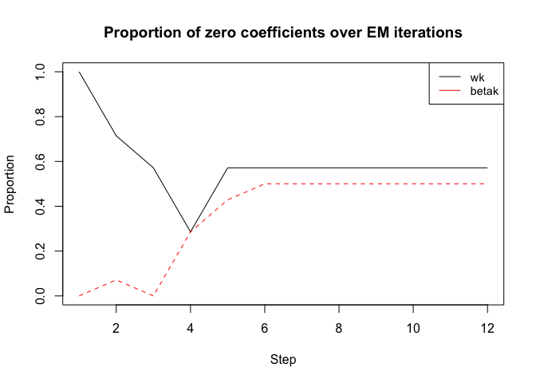

``` r
# Application to a real data set

data("cleveland")
X <- as.matrix(cleveland[, -15])
y <- cleveland$V15

K <- 2 # Number of experts
Lambda <- 10
Gamma <- 4
opt <- FALSE # opt = FALSE: proximal Newton; opt = TRUE: proximal Newton-type

prmoe <- PoissonRMoE(Xmat = X, Ymat = y, K = K, Lambda = Lambda, 
                   Gamma = Gamma, option = opt, verbose = TRUE)
#> EM - PRMoE: Iteration: 1 | log-likelihood: -562.01
#> EM - PRMoE: Iteration: 2 | log-likelihood: -332.152625706686
#> EM - PRMoE: Iteration: 3 | log-likelihood: -326.761457475594
#> EM - PRMoE: Iteration: 4 | log-likelihood: -325.325908904562
#> EM - PRMoE: Iteration: 5 | log-likelihood: -324.783798744486
#> EM - PRMoE: Iteration: 6 | log-likelihood: -324.381608161574
#> EM - PRMoE: Iteration: 7 | log-likelihood: -324.02875047977
#> EM - PRMoE: Iteration: 8 | log-likelihood: -323.710030472495
#> EM - PRMoE: Iteration: 9 | log-likelihood: -323.416977203038
#> EM - PRMoE: Iteration: 10 | log-likelihood: -323.148116123692
#> EM - PRMoE: Iteration: 11 | log-likelihood: -322.898111732696
#> EM - PRMoE: Iteration: 12 | log-likelihood: -322.657415160555
#> EM - PRMoE: Iteration: 13 | log-likelihood: -322.421421282559
#> EM - PRMoE: Iteration: 14 | log-likelihood: -322.228879677958
#> EM - PRMoE: Iteration: 15 | log-likelihood: -322.046226491154
#> EM - PRMoE: Iteration: 16 | log-likelihood: -321.863052201154
#> EM - PRMoE: Iteration: 17 | log-likelihood: -321.675971595272
#> EM - PRMoE: Iteration: 18 | log-likelihood: -321.482444241535
#> EM - PRMoE: Iteration: 19 | log-likelihood: -321.280066042427
#> EM - PRMoE: Iteration: 20 | log-likelihood: -321.065093113011
#> EM - PRMoE: Iteration: 21 | log-likelihood: -320.832669646564
#> EM - PRMoE: Iteration: 22 | log-likelihood: -320.577708866227
#> EM - PRMoE: Iteration: 23 | log-likelihood: -320.294588162287
#> EM - PRMoE: Iteration: 24 | log-likelihood: -319.97690236689
#> EM - PRMoE: Iteration: 25 | log-likelihood: -319.6173051157
#> EM - PRMoE: Iteration: 26 | log-likelihood: -319.207364289462
#> EM - PRMoE: Iteration: 27 | log-likelihood: -318.737396384306
#> EM - PRMoE: Iteration: 28 | log-likelihood: -318.193476957884
#> EM - PRMoE: Iteration: 29 | log-likelihood: -317.557348245328
#> EM - PRMoE: Iteration: 30 | log-likelihood: -316.826620340108
#> EM - PRMoE: Iteration: 31 | log-likelihood: -316.151303809299
#> EM - PRMoE: Iteration: 32 | log-likelihood: -315.494857760548
#> EM - PRMoE: Iteration: 33 | log-likelihood: -314.855051438243
#> EM - PRMoE: Iteration: 34 | log-likelihood: -314.263005748425
#> EM - PRMoE: Iteration: 35 | log-likelihood: -313.756129833621
#> EM - PRMoE: Iteration: 36 | log-likelihood: -313.361273778094
#> EM - PRMoE: Iteration: 37 | log-likelihood: -313.082843250613
#> EM - PRMoE: Iteration: 38 | log-likelihood: -312.903474294326
#> EM - PRMoE: Iteration: 39 | log-likelihood: -312.795353307444
#> EM - PRMoE: Iteration: 40 | log-likelihood: -312.738238316712
#> EM - PRMoE: Iteration: 41 | log-likelihood: -312.703865518824
#> EM - PRMoE: Iteration: 42 | log-likelihood: -312.678678324304
#> EM - PRMoE: Iteration: 43 | log-likelihood: -312.656929126162
#> EM - PRMoE: Iteration: 44 | log-likelihood: -312.63622557986
#> EM - PRMoE: Iteration: 45 | log-likelihood: -312.615605460231
#> EM - PRMoE: Iteration: 46 | log-likelihood: -312.594717533347
#> EM - PRMoE: Iteration: 47 | log-likelihood: -312.57347571775
#> EM - PRMoE: Iteration: 48 | log-likelihood: -312.551914399452
#> EM - PRMoE: Iteration: 49 | log-likelihood: -312.530126783923
#> EM - PRMoE: Iteration: 50 | log-likelihood: -312.508236847882
#> EM - PRMoE: Iteration: 51 | log-likelihood: -312.486384725135
#> EM - PRMoE: Iteration: 52 | log-likelihood: -312.464717524639
#> EM - PRMoE: Iteration: 53 | log-likelihood: -312.44338250712
#> EM - PRMoE: Iteration: 54 | log-likelihood: -312.42252156118
#> EM - PRMoE: Iteration: 55 | log-likelihood: -312.402129033142
#> EM - PRMoE: Iteration: 56 | log-likelihood: -312.382171870486
#> EM - PRMoE: Iteration: 57 | log-likelihood: -312.3627558854
#> EM - PRMoE: Iteration: 58 | log-likelihood: -312.343998848104
#> EM - PRMoE: Iteration: 59 | log-likelihood: -312.326005523455
#> EM - PRMoE: Iteration: 60 | log-likelihood: -312.308723306423
#> EM - PRMoE: Iteration: 61 | log-likelihood: -312.291994904998
#> EM - PRMoE: Iteration: 62 | log-likelihood: -312.275724578667
#> EM - PRMoE: Iteration: 63 | log-likelihood: -312.259967338697
#> EM - PRMoE: Iteration: 64 | log-likelihood: -312.244674382594
#> EM - PRMoE: Iteration: 65 | log-likelihood: -312.229801540038
#> EM - PRMoE: Iteration: 66 | log-likelihood: -312.215320236346
#> EM - PRMoE: Iteration: 67 | log-likelihood: -312.201214825162
#> EM - PRMoE: Iteration: 68 | log-likelihood: -312.187480664592
#> EM - PRMoE: Iteration: 69 | log-likelihood: -312.174122188404
#> EM - PRMoE: Iteration: 70 | log-likelihood: -312.161150904208
#> EM - PRMoE: Iteration: 71 | log-likelihood: -312.14858337234
#> EM - PRMoE: Iteration: 72 | log-likelihood: -312.136439244245
#> EM - PRMoE: Iteration: 73 | log-likelihood: -312.124739437675
#> EM - PRMoE: Iteration: 74 | log-likelihood: -312.113504514237
#> EM - PRMoE: Iteration: 75 | log-likelihood: -312.102754528004
#> EM - PRMoE: Iteration: 76 | log-likelihood: -312.092504114092
#> EM - PRMoE: Iteration: 77 | log-likelihood: -312.082765666685
#> EM - PRMoE: Iteration: 78 | log-likelihood: -312.073547456836
#> EM - PRMoE: Iteration: 79 | log-likelihood: -312.064853359296
#> EM - PRMoE: Iteration: 80 | log-likelihood: -312.056682821686
#> EM - PRMoE: Iteration: 81 | log-likelihood: -312.049033891972
#> EM - PRMoE: Iteration: 82 | log-likelihood: -312.041894560713
#> EM - PRMoE: Iteration: 83 | log-likelihood: -312.035252492723
#> EM - PRMoE: Iteration: 84 | log-likelihood: -312.029092280941
#> EM - PRMoE: Iteration: 85 | log-likelihood: -312.023395955555
#> EM - PRMoE: Iteration: 86 | log-likelihood: -312.018143503313
#> EM - PRMoE: Iteration: 87 | log-likelihood: -312.013313370009
#> EM - PRMoE: Iteration: 88 | log-likelihood: -312.008882932001
#> EM - PRMoE: Iteration: 89 | log-likelihood: -312.004828926216
#> EM - PRMoE: Iteration: 90 | log-likelihood: -312.001127832166
#> EM - PRMoE: Iteration: 91 | log-likelihood: -311.997756202871
#> EM - PRMoE: Iteration: 92 | log-likelihood: -311.994691554608

prmoe$plot()
```

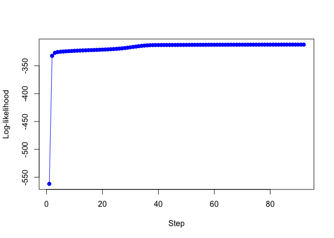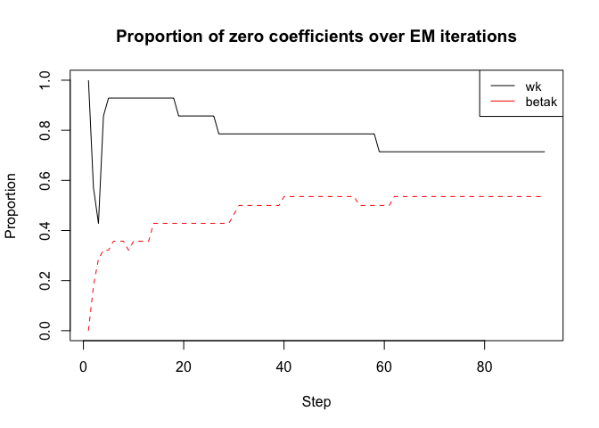

</details>
